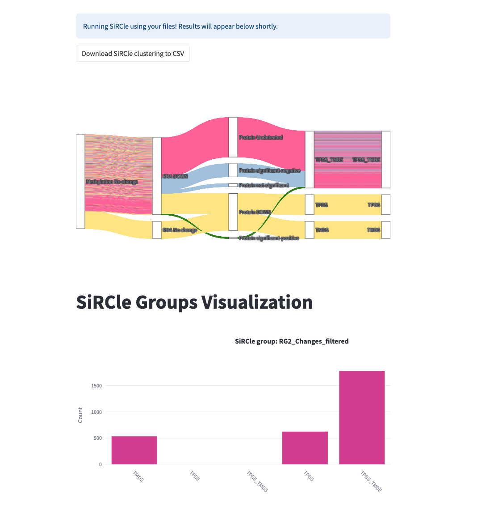
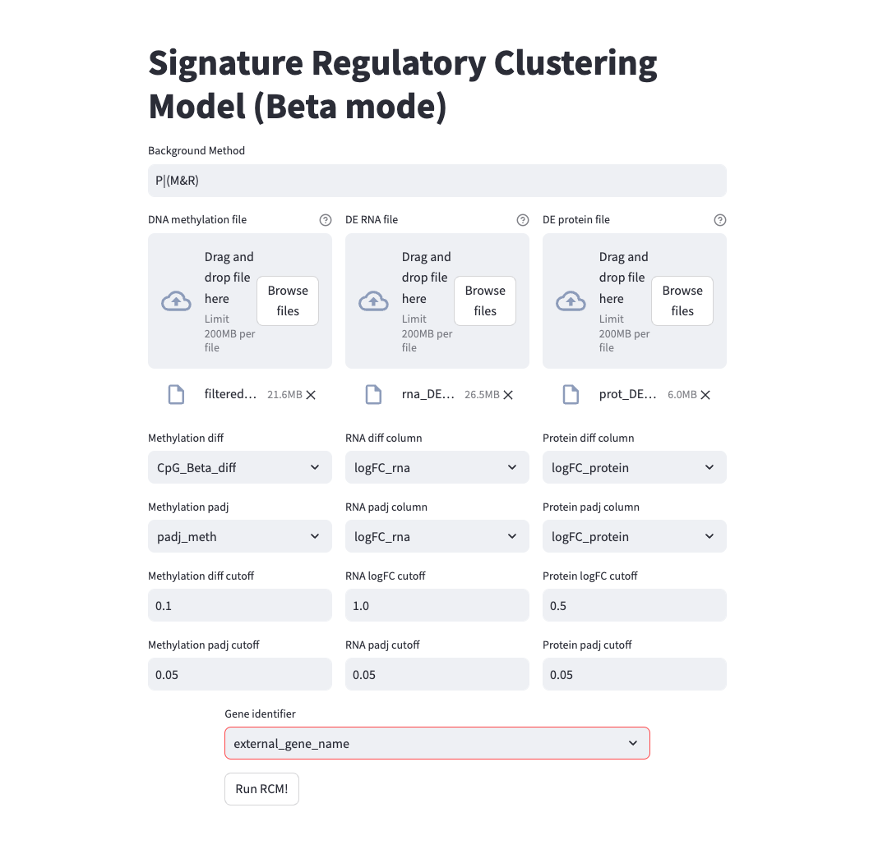
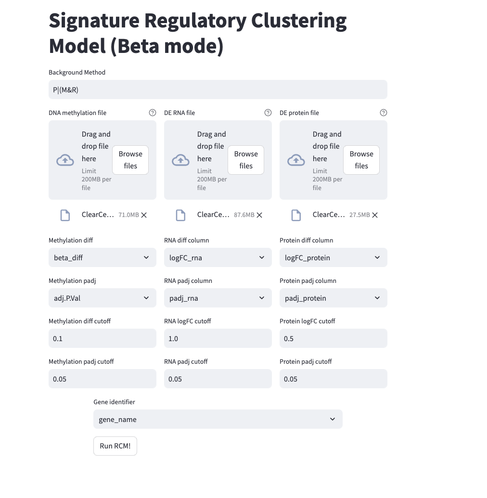
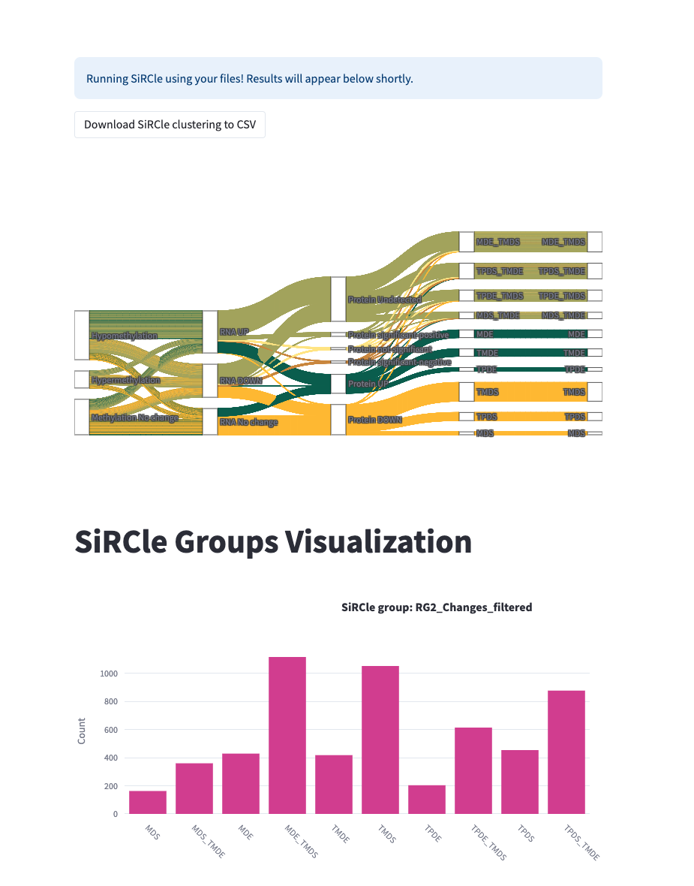

# A Beta project for SiRCle web application

Web app for the first half of SiRCle (i.e. the regulatory clustering). Try the [website](https://arianemora-sircle-web-app-ndu996.streamlit.app/).

Test it out with the [data](data/) in the data folder. Use the columns in the screenshot below.

### Upload with data from the paper looks like:


### Results from the paper looks like:


Please provide feedback! Let me know if you would like to see the second part (i.e. the variational auto encoder incoperated into this!)
Leave a feature request in the issues or send me an email at ariane.n.mora@gmail.com. 

### Upload with data from the paper looks like:


### Results from the paper looks like:


(this is using the parameters from the paper data).

### Cite
Cite our paper please if you use it: 
https://www.biorxiv.org/content/10.1101/2022.07.02.498058v1 

### Developers

```
streamlit run app.py
```

#### References
Streamlit app based on: https://share.streamlit.io/streamlit/example-app-csv-wrangler/
Thanks to you who made it <3 